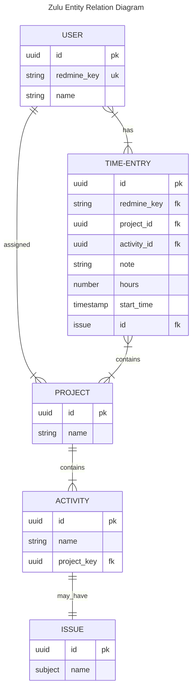
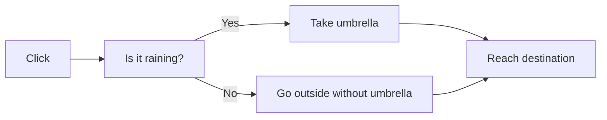

# ERD

# FLOW

## Timer

1. Click start timer
2. Set `start_time` to current timestamp
3. In UI compare the start time to the current time and add elapsed time
4. Click Stop timer
5. Calculate and save the `hours` columns.
6. Set start time to null
