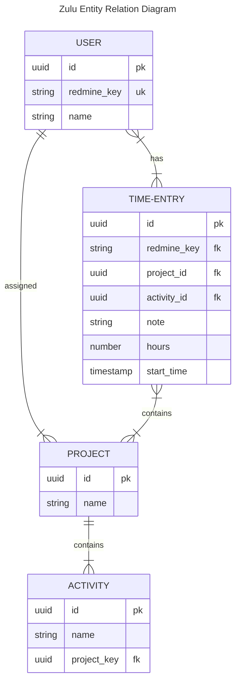

ERD

```mermaid
---
title: Zulu Entity Relation Diagram
---
erDiagram
    USER ||--|{ PROJECT : assigned
    PROJECT ||--|{ ACTIVITY : contains
    USER }|--|{ TIME-ENTRY : has
    TIME-ENTRY }|--|{ PROJECT : contains

    USER {
      uuid id pk
      string redmine_key uk
      string name
    }

    PROJECT {
      uuid id pk
      string name
    }

    ACTIVITY {
      uuid id pk 
      string name
      uuid project_key fk
    }

    TIME-ENTRY {
      uuid id pk
      string redmine_key fk
      uuid project_id fk
      uuid activity_id fk
      string note 
      number hours
      timestamp start_time
    }
```

#FLOW

```mermaid
  
```